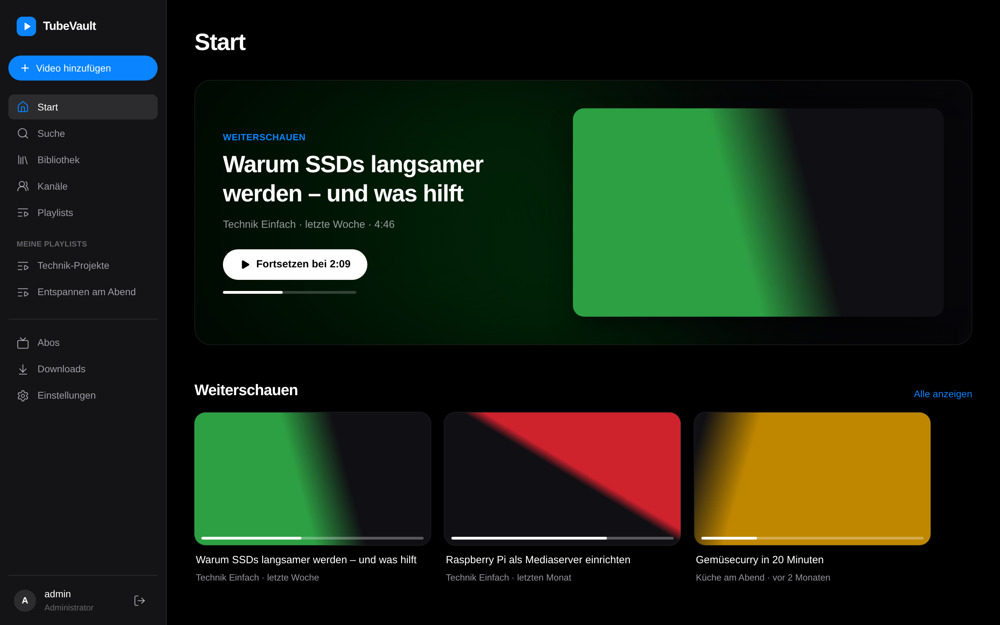
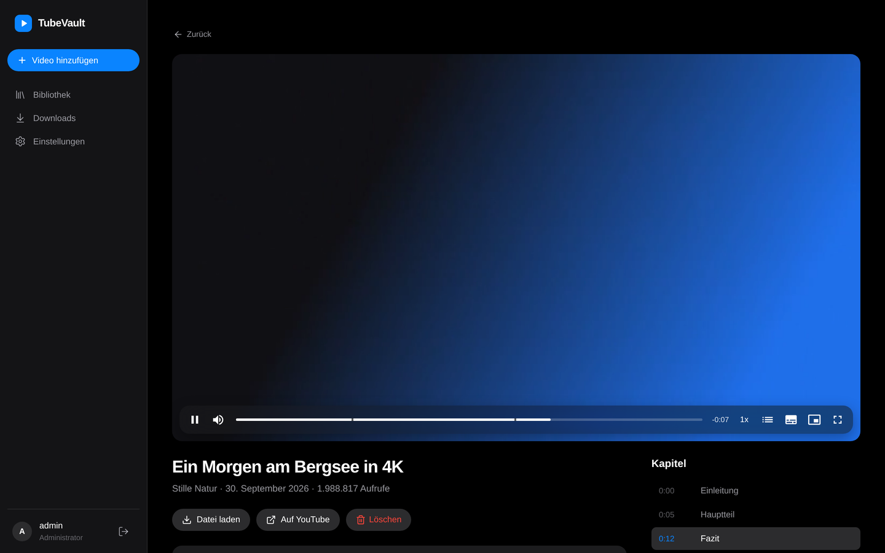
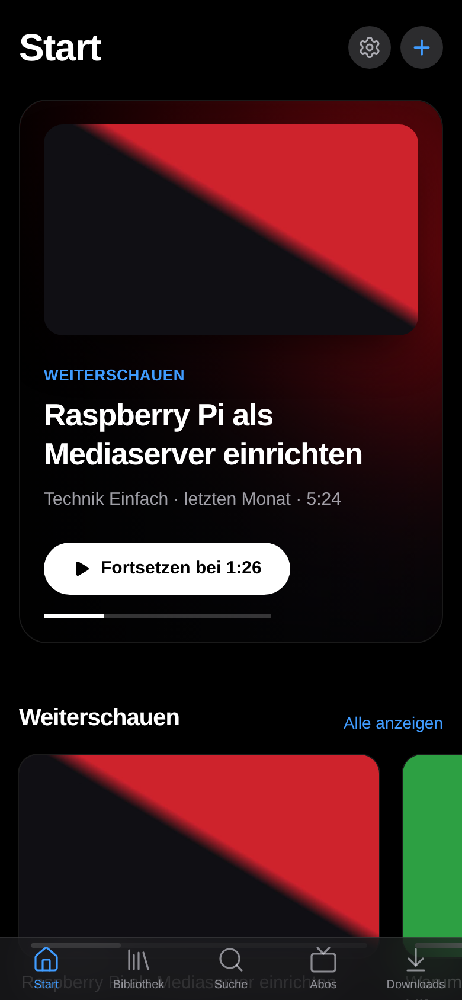
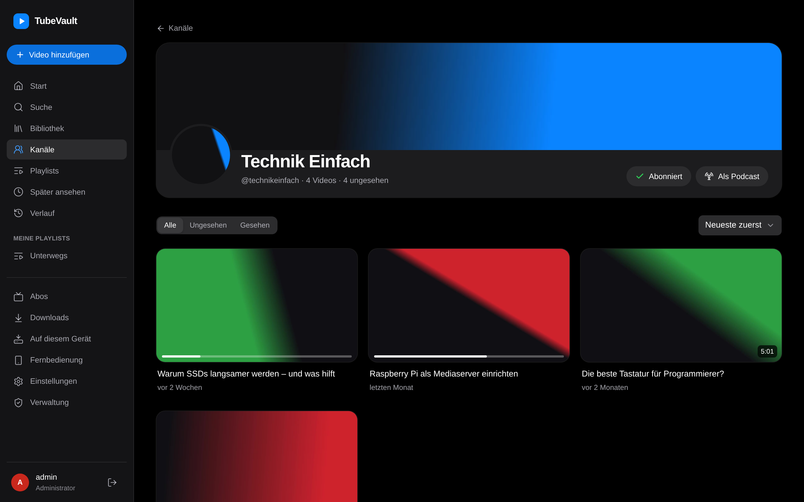
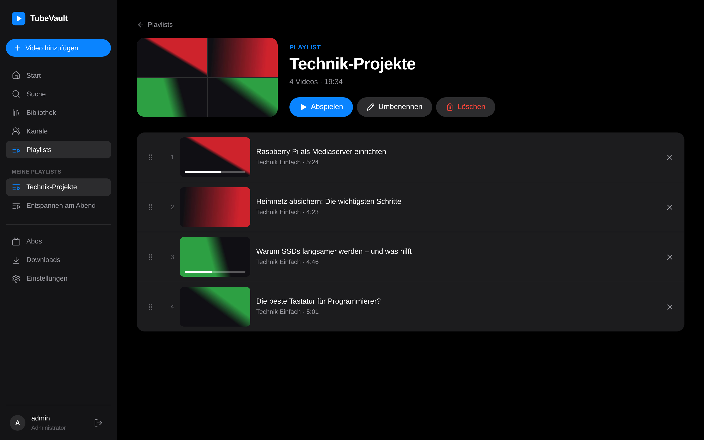
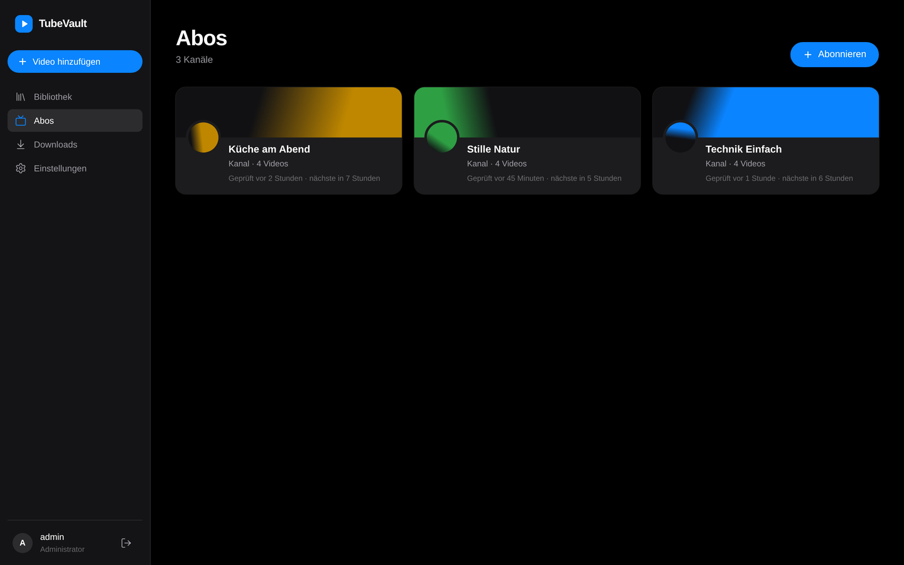
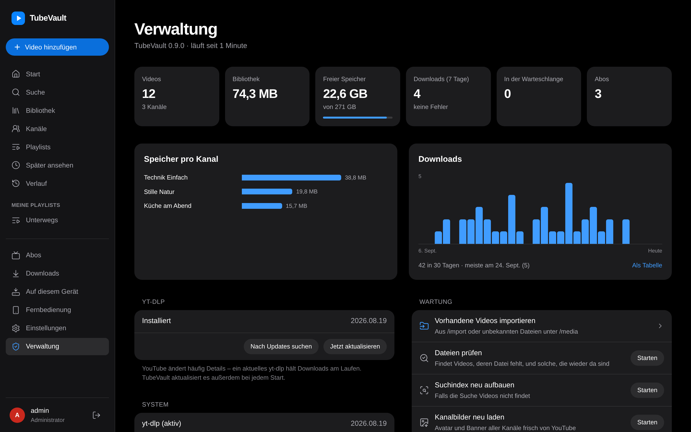
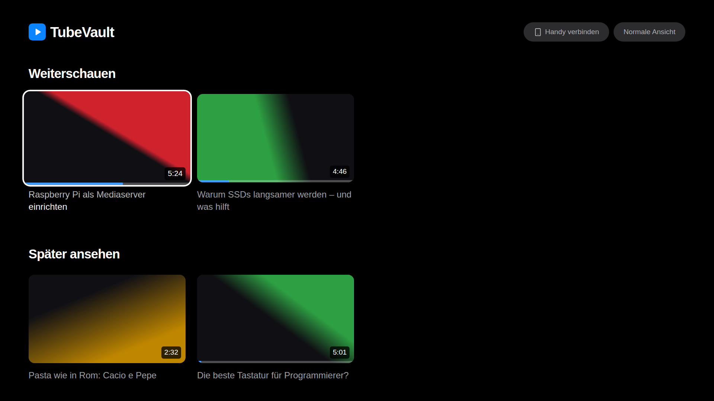

<p align="center">
  
</p>

<h1 align="center">TubeVault</h1>

<p align="center">
  Selbstgehosteter Media-Server für YouTube-Inhalte und eigene Videos – herunterladen, mit
  Metadaten ablegen und in einer ruhigen Bibliothek im Stil von Apple TV ansehen, auch auf dem
  Fernseher.<br />
  Ohne Werbung, ohne Tracking, komplett auf deinem Server.
</p>

<p align="center">
  <a href="https://github.com/Lua-x/TubeVault/actions/workflows/ci.yml"></a>
  <a href="https://github.com/Lua-x/TubeVault/actions/workflows/docker.yml"></a>
</p>

<p align="center">
  <picture>
    <source media="(prefers-color-scheme: light)" srcset="docs/screenshots/home-desktop-light.png" />
    
  </picture>
</p>

<p align="center">
  
  &nbsp;
  
</p>

<p align="center">
  
  &nbsp;
  
</p>

<p align="center">
  
  &nbsp;
  
</p>

<p align="center">
  
</p>

> Die Screenshots zeigen Demo-Videos, die mit `backend/scripts/seed_demo.py` erzeugt wurden.

## Funktionen

**Version 0.9 – Familie & Wohnzimmer**

- **„Wer schaut?“:** Auf Familiengeräten wie dem Fernseher oder dem Tablet in der Küche
  wählt man sein Profil mit einem Tipp statt sich anzumelden – Admins und Erwachsene auf
  Wunsch hinter einer PIN, Kinderprofile ohne
- **Handy als Fernbedienung:** Code vom Fernseher eintippen oder scannen, dann steuert das
  Handy die TV-Ansicht und schickt Videos auf den Fernseher
- **Gemeinsam schauen:** einen Link teilen, und alle sehen dasselbe Video im Gleichtakt –
  jeder darf pausieren und spulen
- **Vorschaubilder beim Spulen** und **gleiche Lautstärke** für laute und leise Videos,
  einmal pro Video im Hintergrund berechnet
- **Untertitel per Spracherkennung** für Videos ohne Untertitel, auf deinem Server – das
  Programm wird erst auf Knopfdruck geladen
- **Tempo pro Kanal:** 1,5× beim Podcast-Kanal, normal bei der Musik – der Player merkt sich
  die Geschwindigkeit für jeden Kanal

**Version 0.8 – Wohnzimmer & Media-Server**

- **Auf den Fernseher:** ein Knopf im Player schickt das Video per Chromecast oder AirPlay
  an den Fernseher – ohne Skript von Google, über das, was Chrome und Safari eingebaut haben
- **TV-Ansicht** mit großen Kacheln für die Fernbedienung; Smart-TVs landen von selbst dort
- **DLNA-Server:** Smart-TVs, Konsolen, VLC und Kodi finden deine Bibliothek im Heimnetz,
  ganz ohne App – ab Werk aus, nur im Heimnetz und mit den Rechten eines gewählten Kontos
- **Nur Media-Server:** Der YouTube-Downloader lässt sich abschalten; dann spricht TubeVault
  mit niemandem mehr außer deinen Geräten
- **Eigene Videos** von Kamera oder Handy importieren – der Ordner wird zum Kanal, Titel und
  Aufnahmedatum kommen aus der Datei
- Barrierefreiheit nach WCAG AA (Kontraste, Tastatur, Bildschirmleser) und ein schnellerer
  Start auf Handy und Fernseher

**Version 0.7 – Hören & Entdecken**

- **Anhören:** Videos und ganze Playlists nur mit Ton, mit Mini-Player, der beim Stöbern
  weiterläuft, Steuerung auf dem Sperrbildschirm, Geschwindigkeit und Schlaf-Timer – auch
  „Aufs Gerät“ als reines Audio
- **Als Podcast:** Kanäle und Playlists als Feed für deine Podcast-App
- **Kommentare** auf Wunsch mitspeichern und offline lesen – global, pro Abo oder pro Video
- **Später ansehen** und **Verlauf**, **ähnliche Videos** aus der eigenen Bibliothek
- Zeitstempel in Beschreibung und Kommentaren springen im Player an die Stelle
- Suche mit Filtern nach Länge, Upload-Datum und Kanal

**Version 0.6 – Konten & unterwegs**

- **Aufs Gerät laden:** Videos und ganze Playlists in der installierten App speichern und
  unterwegs ohne Verbindung zum Server schauen – als Original oder als kompakte Fassung in
  720p/480p, die dein Server erzeugt. Ist der Server nicht erreichbar, startet die App direkt
  mit deinen gespeicherten Videos; der Fortschritt landet später auf dem Server
- **Zwei-Faktor-Anmeldung** mit jeder Authenticator-App, samt Wiederherstellungscodes
- **Anmeldung über deinen eigenen Anmeldedienst** (OpenID Connect): Authelia, Authentik,
  Keycloak, Pocket ID & Co. – Konten werden beim ersten Login angelegt, Admin-Rechte auf
  Wunsch über eine Gruppe vergeben
- **Rechte pro Benutzer:** nur ausgewählte Kanäle sehen (z. B. ein Kinderprofil) und
  „Nur schauen“-Konten, die nichts hinzufügen oder abonnieren können

**Version 0.5 – Offline, sicher, automatisch**

- Ohne Internet läuft alles weiter: Bibliothek, Suche und Wiedergabe brauchen nur deinen
  Server. Downloads und Abo-Prüfungen warten, statt zu scheitern, und laufen von selbst
  weiter, sobald das Netz zurück ist
- Sicherung: täglich automatisch, auf Knopfdruck, zum Herunterladen – und wiederherstellen
  direkt in der Verwaltung
- Neue Videos von Abos meist nach Minuten statt Stunden (RSS-Vorab-Check)
- Bessere Qualität automatisch nachladen, wenn YouTube kurz nach dem Upload nur niedrige
  Auflösungen hatte – oder von Hand per „Neu laden“
- Benachrichtigungen an deinen eigenen ntfy- oder Gotify-Server oder per Webhook
- Große Bibliotheken: endloses Scrollen und eine Suche ohne Trefferlimit, getestet mit
  10 000 Videos
- Strengere Sicherheit (Content-Security-Policy, Aufräumregeln nur für Admins) und
  automatische Updates der Abhängigkeiten per Dependabot

**Version 0.4 – Für jedes Gerät und jeden Mediaserver**

- Wiedergabe auf jedem Gerät: Was der Browser nicht direkt kann, wird umverpackt oder beim
  Abspielen umgewandelt (HLS) – mit Qualitätswahl im Player und Spulen
- Hardware-Transcoding mit Intel/AMD (VAAPI) oder NVIDIA (NVENC), Rückfall auf Software
- Jellyfin, Emby, Kodi, Plex: NFO-Dateien und wahlweise ein Serien-Schema (Kanal = Serie,
  Jahr = Staffel); Umschalten zieht die Bibliothek automatisch um
- Import vorhandener Videos, z. B. aus einem alten yt-dlp-Archiv (mit `.info.json`)
- Verwaltung: Statistik, Speicher pro Kanal, yt-dlp-Update auf Knopfdruck samt Neustart,
  Wartung und Protokoll
- API-Tokens für Skripte und Kurzbefehle, Teilen-Ziel auf Android
- Lizenz: AGPL-3.0

**Version 0.3 – Bibliothek & Wiedergabe**

- Startseite mit „Weiterschauen“, „Neu von deinen Abos“ und deinen Kanälen
- Wiedergabefortschritt pro Benutzer: Videos setzen dort fort, wo du aufgehört hast,
  und gelten kurz vor Schluss als gesehen. Filter „Ungesehen“, „Angefangen“, „Gesehen“
- Kanalseiten mit Banner, Avatar und allen Videos – direkt von dort abonnieren
- Volltextsuche über Titel, Beschreibung und Kanal (findet „Brücke“ auch mit „brucke“)
- Eigene Playlists: anlegen, per Drag & Drop sortieren, am Stück abspielen
- [SponsorBlock](https://sponsor.ajay.app): Sponsoren, Intros & Co. beim Abspielen
  überspringen (mit „Zurück“) oder beim Download herausschneiden – global oder pro Abo
- Als App installierbar (PWA) auf iPhone, Android und Desktop

**Version 0.2 – Abos & Automatisierung**

- Kanäle und Playlists abonnieren; neue Videos werden automatisch geladen
- Prüfintervall pro Abo (15 Minuten bis wöchentlich), „Jetzt prüfen“ jederzeit
- Filter pro Abo: Shorts, Livestreams, Mindest-/Maximaldauer, nur Videos ab Datum X
- Qualität und Format pro Abo (z. B. max. 1080p, H.264, MKV)
- Aufräumen: Videos älter als X Tage löschen oder nur die neuesten N behalten –
  von Hand hinzugefügte Videos bleiben immer
- Beim Abonnieren nur die neuesten Videos laden (5, 25, 100 oder alle)
- Verlauf pro Abo: welche Videos geladen, gefiltert oder übersprungen wurden – und warum
- Download-Queue mit Pause/Fortsetzen (einzeln und komplett), Wiederholen, Abbrechen
- Kanal-Avatar und -Banner (auch als `folder.jpg`/`banner.jpg` für Jellyfin)

**Version 0.1 (MVP)**

- Video per YouTube-Link hinzufügen – Download mit [yt-dlp](https://github.com/yt-dlp/yt-dlp) und ffmpeg
- Metadaten, Thumbnail, Kapitel und Untertitel (manuell + automatisch in Originalsprache)
- Download-Queue mit Live-Fortschritt (WebSocket), Abbrechen, Wiederholen und automatischen
  Retries mit Backoff bei Netzwerkfehlern und Rate-Limits
- Bibliothek mit Suche und Sortierung, Videoseite mit Player (Spulen per HTTP Range,
  Kapitel, Untertitel, Tastaturkürzel, Bild-in-Bild)
- MP4 (Standard, H.264 für maximale Kompatibilität) oder MKV, Qualität bis 4K
- Mehrere Benutzer, Admin-Rolle, Login mit Session-Cookie
- Dunkles, Apple-artiges UI mit Hell/Dunkel/System, Sidebar auf dem Desktop,
  Tab-Bar auf dem Smartphone
- Ordnerstruktur kompatibel mit Jellyfin/Plex: `/media/<Kanal>/<Jahr>/<Titel> [<ID>].mp4`
- Ein einziger Container, läuft auf amd64 und arm64 (Raspberry Pi, NAS)

Ideen und Wünsche für weitere Versionen gern als
[Issue](https://github.com/Lua-x/TubeVault/issues).

## Installation

Voraussetzung: Docker mit Compose. Lege einen Ordner an (z. B. `~/tubevault`) und darin eine
`docker-compose.yml`.

### Variante A: fertiges Image von GHCR (empfohlen)

```yaml
services:
  tubevault:
    image: ghcr.io/lua-x/tubevault:latest
    container_name: tubevault
    ports:
      - "8096:8096"
    environment:
      - PUID=1000
      - PGID=1000
      - TZ=Europe/Berlin
    volumes:
      - ./config:/config
      - /pfad/zu/videos:/media
    restart: unless-stopped
```

```sh
docker compose up -d
```

Öffne dann `http://<server>:8096`. Beim ersten Aufruf legst du das Administrator-Konto an.

> **Privates Repository:** Solange das Repository privat ist, ist auch das Image auf GHCR
> privat. Melde dich dann auf dem Server einmalig an – mit einem
> [Personal Access Token](https://github.com/settings/tokens) mit dem Recht `read:packages`:
> `echo <TOKEN> | docker login ghcr.io -u <dein-github-name> --password-stdin`.
> Alternativ das Paket unter *GitHub → Packages → tubevault → Package settings* öffentlich machen.

### Variante B: selbst bauen

```yaml
services:
  tubevault:
    build: .
    container_name: tubevault
    ports:
      - "8096:8096"
    environment:
      - PUID=1000
      - PGID=1000
      - TZ=Europe/Berlin
    volumes:
      - ./config:/config
      - /pfad/zu/videos:/media
    restart: unless-stopped
```

```sh
git clone https://github.com/Lua-x/TubeVault.git
cd TubeVault
docker compose up -d --build
```

Die mitgelieferte [`docker-compose.yml`](docker-compose.yml) ist genau diese Variante.

### Benutzer-IDs (PUID/PGID)

Der Container startet kurz als root, übernimmt `PUID`/`PGID`, setzt die Rechte von `/config`
und läuft danach als normaler Benutzer – wie bei den linuxserver.io-Images. Die IDs deines
Benutzers bekommst du mit `id`. In `/media` werden nur der oberste Ordner und
`/media/.tubevault` angepasst, deine vorhandenen Dateien bleiben unangetastet.

Statt `PUID`/`PGID` funktioniert auch `user: "1000:1000"` in der Compose-Datei. Dann läuft
gar nichts als root – die Ordner für `/config` und `/media` musst du dann vorher selbst
anlegen und diesem Benutzer geben.

## Konfiguration

| Variable | Standard | Bedeutung |
| -------- | -------- | --------- |
| `PUID` / `PGID` | `1000` | Benutzer und Gruppe, denen die Dateien gehören |
| `TZ` | `Etc/UTC` | Zeitzone, z. B. `Europe/Berlin` |
| `PORT` | `8096` | Port im Container |
| `BASE_PATH` | leer | Unterpfad hinter einem Reverse Proxy, z. B. `/tubevault` |
| `ADMIN_USER` / `ADMIN_PASSWORD` | leer | Legt beim ersten Start einen Admin an (Passwort ≥ 8 Zeichen). Leer = Einrichtung im Browser |
| `YTDLP_AUTO_UPDATE` | `true` | yt-dlp bei jedem Start auf die neueste Version aktualisieren |
| `FORWARDED_ALLOW_IPS` | `*` | IPs der Reverse Proxys, deren `X-Forwarded-*`-Header vertraut wird |
| `LOG_LEVEL` | `INFO` | `DEBUG`, `INFO`, `WARNING`, `ERROR` |
| `SESSION_DAYS` | `30` | Wie lange eine Anmeldung gültig bleibt |
| `IMPORT_DIR` | `/import` | Ordner, aus dem **Verwaltung → Import** vorhandene Videos übernimmt |
| `PUBLIC_URL`, `OIDC_*`, `PASSWORD_LOGIN` | leer | Anmeldung über einen eigenen Anmeldedienst, siehe [Anmeldung](#anmeldung) |

Alles Weitere – Format (MP4/MKV), maximale Qualität, H.264 bevorzugen, Untertitel-Sprachen,
SponsorBlock, Hardware-Transcoding, Ordnerstruktur, parallele Downloads, Benutzer – stellst du in
der App unter **Einstellungen** ein.
Jeder Benutzer legt dort außerdem fest, ob Playlists automatisch weiterlaufen und ob
SponsorBlock-Abschnitte automatisch übersprungen werden.
Eine Vorlage für eine `.env`-Datei liegt in [`.env.example`](.env.example).

### Volumes

| Pfad | Inhalt |
| ---- | ------ |
| `/config` | Datenbank (`tubevault.db`), Sicherungen (`backups/`), Logs (`logs/`), aktualisiertes yt-dlp und – falls eingerichtet – die Spracherkennung (`.runtime/`), Sprachmodelle (`models/`) |
| `/media` | Videos, Thumbnails, Untertitel, NFOs – der Unterordner `.tubevault/` enthält nur temporäre Downloads, den Umwandlungs-Cache und die Vorschaubilder fürs Spulen |
| `/import` | Optional: vorhandene Videos zum Importieren (darf schreibgeschützt sein, dann „Kopieren“ wählen) |

Ordnerstruktur in `/media` (Standard „TubeVault“):

```
/media
└── Kanalname/
    ├── folder.jpg        (Kanal-Avatar)
    ├── banner.jpg        (Kanal-Banner)
    └── 2026/
        ├── Titel des Videos [dQw4w9WgXcQ].mp4
        ├── Titel des Videos [dQw4w9WgXcQ].nfo
        ├── Titel des Videos [dQw4w9WgXcQ]-thumb.jpg
        ├── Titel des Videos [dQw4w9WgXcQ].de.vtt
        └── Titel des Videos [dQw4w9WgXcQ].en.vtt
```

Unter **Einstellungen → Mediaserver** lässt sich auf das Serien-Schema umschalten. Dann wird
jeder Kanal in Jellyfin, Emby, Kodi oder Plex zur Serie und jedes Jahr zur Staffel:

```
/media
└── Kanalname/
    ├── tvshow.nfo, folder.jpg, banner.jpg, fanart.jpg
    └── Season 2026/
        ├── 2026-08-23 - Titel des Videos [dQw4w9WgXcQ].mp4
        ├── 2026-08-23 - Titel des Videos [dQw4w9WgXcQ].nfo
        └── …
```

Beim Umschalten verschiebt TubeVault alle vorhandenen Dateien – danach in Jellyfin/Plex die
Bibliothek neu scannen (Bibliothekstyp „Serien“ bzw. „Filme“/„Heimvideos“ beim TubeVault-Schema).
Titel, Kapitel und Beschreibung sind zusätzlich in die Videodatei eingebettet; eigene
NFO-Dateien anderer Programme überschreibt TubeVault nie.

### Import

**Verwaltung → Import** übernimmt Videos, die schon auf der Platte liegen – aus dem optionalen
`/import`-Volume oder von unbekannten Dateien unter `/media`. Die YouTube-ID kommt aus einer
`.info.json` von yt-dlp (dann auch Titel, Kanal, Datum) oder aus dem Dateinamen
(`Titel [ID].mp4`, `Titel (ID).mp4`, `Titel-ID.mp4`). Fehlende Infos lädt TubeVault von YouTube;
gibt es ein Video dort nicht mehr, nimmt es den Dateinamen. Thumbnails und Untertitel
(`.vtt`, `.srt`) neben der Datei werden mitgenommen, fehlende Thumbnails erzeugt ffmpeg.

**Eigene Videos:** Dateien ohne YouTube-ID – vom Handy, der Kamera, der letzten Feier –
übernimmt der Import als eigene Videos. Der Ordner wird zum Kanal
(`/import/Urlaub 2024/IMG_1234.mp4` landet in „Urlaub 2024“, Dateien direkt im Ordner in
„Eigene Videos“), Titel, Beschreibung und Aufnahmedatum liest TubeVault aus der Datei, sonst
nimmt es den Dateinamen und das Änderungsdatum. Eine Kopie derselben Datei erkennt es wieder.
Eigene Videos laufen überall mit – Player, TV-Ansicht, DLNA, Playlists, Podcasts, Kinderprofile
(der Ordner lässt sich wie ein Kanal freigeben); Kommentare, SponsorBlock und „Neu laden“ gibt
es für sie nicht. Damit kein altes Archiv aus Versehen so landet, sind sie im Import erst
angehakt, wenn der YouTube-Downloader aus ist.

### Nur Media-Server

Unter **Einstellungen → Betrieb** lässt sich der **YouTube-Downloader** ausschalten. Dann ist
TubeVault ein reiner Media-Server für deine vorhandenen und eigenen Videos:

- keine Verbindung mehr zu YouTube oder SponsorBlock – auch kein yt-dlp-Update beim Start
- keine Abo-Prüfungen, Downloads, Kommentare, Kanalbilder oder Qualitäts-Upgrades; „Video
  hinzufügen“, Abos und Downloads verschwinden aus der App, die API lehnt sie ab
- die Aufräumregeln der Abos pausieren, damit die Bibliothek nicht nach und nach schrumpft
- neue Videos kommen über **Verwaltung → Import** dazu

Einzige Ausnahme, nur auf deinen Klick: das Einrichten der
[Spracherkennung](#untertitel-per-spracherkennung) lädt einmalig Programm und Modell.

Abos, Warteschlange und Einstellungen bleiben gespeichert; wer den Downloader wieder
einschaltet, macht genau dort weiter.

### Abos

Unter **Abos → Abonnieren** fügst du einen Kanal (`https://www.youtube.com/@name`,
`/channel/…`, `/c/…`) oder eine Playlist (`…/playlist?list=…`) hinzu.

- **Vorhandene Videos:** Beim ersten Prüfen lädt TubeVault standardmäßig nur die neuesten 5
  Videos. Ältere werden als „übersprungen“ gemerkt und später nicht nachgeladen.
- **Filter** greifen zweimal: grob anhand der Kanalliste (spart Downloads) und exakt, sobald
  die Metadaten eines Videos geladen sind. Herausgefilterte Videos tauchen im Verlauf des Abos
  mit Grund auf. Nach einer Filteränderung bewertet „Neu bewerten“ sie noch einmal.
- **Aufräumen** („älter als X Tage“ nach Upload-Datum, „nur die neuesten N“) läuft stündlich
  und nach jedem Download. Gelöscht wird ein Video nur, wenn kein anderes Abo es behalten will
  und es nicht von Hand hinzugefügt wurde. Gelöschte Videos lädt das Abo nicht erneut.
- **Kanäle**: Für Shorts und Livestreams werden die jeweiligen Tabs des Kanals mitgelesen.
  Laufende oder angekündigte Livestreams werden erst nach dem Ende geladen.
- **Schneller finden:** Alle 15 Minuten schaut TubeVault in den kleinen RSS-Feed jedes Abos
  (die letzten 15 Uploads). Taucht dort ein unbekanntes Video auf, zieht es die gründliche
  Prüfung vor – neue Videos sind so meist nach Minuten da, ohne den Kanal ständig komplett
  abzufragen. Abschaltbar unter **Einstellungen → Automatik**.
- **Bessere Qualität nachladen:** Kurz nach dem Upload bietet YouTube oft nur niedrige
  Auflösungen an. Liegt ein Video unter der Zielqualität (Limit des Abos, sonst 1080p), fragt
  TubeVault in den ersten 7 Tagen bis zu zweimal täglich nach und ersetzt die Datei, sobald es
  eine bessere gibt. Wiedergabestand und Playlists bleiben, und bis zum Austausch läuft die
  alte Fassung weiter. Admins können jedes Video auf seiner Seite mit **Neu laden** erneut
  holen, etwa nach dem Wechsel auf 4K.

### Benutzer und Rechte

Unter **Einstellungen → Benutzer** legen Admins weitere Konten an. Ein Klick auf einen
Benutzer öffnet seine Rechte:

- **Admin:** darf alles, auch Einstellungen, Benutzer und Verwaltung.
- **Kanäle:** „Alle“ oder nur ausgewählte. Wer nur ausgewählte Kanäle sieht, findet alles
  andere nirgends – nicht in der Bibliothek, der Suche, auf der Startseite oder per direktem
  Link. Ideal für ein Kinderprofil.
- **Darf Videos hinzufügen:** aus = „Nur schauen“. Hinzufügen, Abos und die Download-Seite
  verschwinden dann aus der Oberfläche und sind auch per API gesperrt.

Wiedergabestand, Playlists und „Aufs Gerät“ gehören immer dem einzelnen Benutzer.

### Anmeldung

**Zwei-Faktor-Anmeldung:** Unter **Einstellungen → Konto → Zwei-Faktor-Anmeldung** den
QR-Code mit einer Authenticator-App scannen (z. B. Aegis, 2FAS, Google Authenticator, die
Passwörter-App auf dem iPhone). Danach fragt TubeVault beim Anmelden nach dem 6-stelligen
Code. Die zehn Wiederherstellungscodes gut aufbewahren – jeder gilt einmal, falls das Handy
weg ist. Admins können die Zwei-Faktor-Anmeldung eines Benutzers zurücksetzen; für den
eigenen Admin hilft notfalls
`docker exec -it tubevault python -m app reset-2fa <benutzer>`.

**Eigener Anmeldedienst (OpenID Connect):** Läuft bei dir schon Authelia, Authentik,
Keycloak, Pocket ID oder ein anderer OIDC-Anbieter, meldest du dich darüber an – mit dessen
Zwei-Faktor-Schutz und ohne eigenes TubeVault-Passwort. Eingerichtet wird das über
Umgebungsvariablen, das Client-Secret landet so weder in der Datenbank noch in Sicherungen:

| Variable | Standard | Bedeutung |
| -------- | -------- | --------- |
| `PUBLIC_URL` | leer | Adresse, unter der TubeVault erreichbar ist, samt `BASE_PATH`, z. B. `https://tube.example.com`. Leer = aus der Anfrage ermitteln |
| `OIDC_ISSUER` | leer | Adresse des Anbieters, z. B. `https://auth.example.com` (Authentik: `https://auth.example.com/application/o/tubevault/`). Leer = aus |
| `OIDC_CLIENT_ID` / `OIDC_CLIENT_SECRET` | leer | Zugangsdaten des Clients beim Anbieter |
| `OIDC_NAME` | `SSO` | Text auf dem Knopf: „Mit … anmelden“ |
| `OIDC_SCOPES` | `openid profile email groups` | Angefragte Scopes |
| `OIDC_USERNAME_CLAIM` | `preferred_username` | Woraus der Benutzername neuer Konten entsteht |
| `OIDC_GROUPS_CLAIM` | `groups` | Wo die Gruppen stehen |
| `OIDC_ADMIN_GROUP` | leer | Mitglieder dieser Gruppe werden Admins, alle anderen nicht (der letzte Admin bleibt immer). Leer = Rechte in TubeVault verwalten |
| `OIDC_AUTO_CREATE` | `true` | Unbekannte Konten beim ersten Login anlegen. `false` = nur verbundene Konten dürfen rein |
| `OIDC_TOKEN_AUTH` | `client_secret_basic` | Oder `client_secret_post` – wie beim Anbieter eingestellt |
| `PASSWORD_LOGIN` | `true` | `false` = nur noch über den Anbieter anmelden (wirkt nur, wenn OIDC eingerichtet ist) |

Beim Anbieter legst du einen vertraulichen Client („confidential“) mit dieser
Weiterleitungsadresse an – **Verwaltung → Anmeldung über OIDC** zeigt sie dir auch an:

```
https://tube.example.com/api/auth/oidc/callback
```

<details>
<summary>Authelia</summary>

```yaml
identity_providers:
  oidc:
    clients:
      - client_id: tubevault
        client_name: TubeVault
        client_secret: '$pbkdf2-sha512$…'   # authelia crypto hash generate pbkdf2
        authorization_policy: two_factor
        redirect_uris:
          - https://tube.example.com/api/auth/oidc/callback
        scopes: [openid, profile, email, groups]
        token_endpoint_auth_method: client_secret_basic
```

`OIDC_ISSUER=https://auth.example.com`
</details>

<details>
<summary>Authentik</summary>

*Anwendungen → Provider → OAuth2/OpenID-Provider*, Client-Typ *Vertraulich*,
Weiterleitungs-URI wie oben. Dann eine Anwendung mit dem Slug `tubevault` anlegen.
`OIDC_ISSUER=https://auth.example.com/application/o/tubevault/`
</details>

<details>
<summary>Keycloak</summary>

Client mit *Client authentication* an, *Valid redirect URIs* wie oben. Für Gruppen im
dedizierten Client-Scope einen Mapper *Group Membership* mit dem Token-Claim-Namen `groups`
anlegen („Full group path“ aus) und `OIDC_SCOPES=openid profile email` setzen – einen Scope
`groups` kennt Keycloak von sich aus nicht. `OIDC_ISSUER=https://auth.example.com/realms/<realm>`
</details>

<details>
<summary>Pocket ID</summary>

*OIDC Clients → Hinzufügen*, Callback-URL wie oben. `OIDC_ISSUER=https://id.example.com`
</details>

Das erste Konto, das sich so anmeldet, wird Admin, wenn es noch keine Benutzer gibt.
Bestehende TubeVault-Konten verbindest du unter **Einstellungen → Konto → Anmeldung über …**
(nur angemeldet möglich – ein gleicher Benutzername allein reicht nie). Konten ohne Passwort
können eins festlegen, um auch ohne den Anbieter hereinzukommen.

### Ohne Internet

TubeVault ist ein Mediaserver zum Offline-Schauen: Bibliothek, Suche, Wiedergabe, Playlists
und Fortschritt brauchen nur deinen Server, die Oberfläche lädt nichts von außen. Fällt das
Internet aus,

- warten Downloads, statt nach ein paar Versuchen endgültig zu scheitern, und starten von
  selbst, sobald das Netz zurück ist (die Download-Seite zeigt das an),
- werden Abo-Prüfungen, Kanalbilder, SponsorBlock und der RSS-Check still verschoben – ohne
  Fehlermeldungen an jedem Abo,
- startet der Container sofort, statt auf das yt-dlp-Update zu warten.

Ob YouTube erreichbar ist, prüft TubeVault nur nach einem Netzwerkfehler, nie regelmäßig.

### Aufs Gerät laden


Für unterwegs, wenn dein Server nicht erreichbar ist (Zug, Flugzeug, Urlaub): **Aufs Gerät**
auf der Videoseite oder bei einer Playlist speichert Videos in der installierten App.

- **Original:** die Datei so, wie sie auf dem Server liegt – MKV wird dafür einmal in MP4
  umverpackt. Passt der Codec nicht zum Gerät, bietet TubeVault nur die kompakten Fassungen an.
- **Kompakt · 720p** und **Sparsam · 480p:** dein Server wandelt das Video einmal in H.264
  um, das auf jedem Gerät läuft. Höchstens etwa 1,4 GB pro Stunde in 720p und 0,65 GB in
  480p, meist deutlich weniger – der Dialog schätzt die Größe vorher. Die Fassung bleibt eine
  Weile im Umwandlungs-Cache.

Alles Gespeicherte steht unter **Auf diesem Gerät** (auch als Tab in der Bibliothek), mit
Untertiteln, Kapiteln und Vorschaubild. Ist der Server beim Öffnen der App nicht erreichbar,
startet sie direkt dort. Wo du aufgehört hast, merkt sich das Gerät und gibt es weiter,
sobald der Server wieder antwortet.

Gut zu wissen:

- Es braucht **HTTPS** (siehe [Reverse Proxy](#reverse-proxy)) – über `http://` mit einer
  IP-Adresse geben Browser keinen Speicher frei, der Knopf erscheint dann nicht.
- **Die App muss geöffnet bleiben**, bis der Download fertig ist. Browser können Downloads im
  Hintergrund nicht fortsetzen; ein abgebrochener Download startet beim nächsten Versuch neu.
- Gespeichert wird im Speicher des Browsers für diese Seite. Wer die Website-Daten löscht oder
  die App vom Home-Bildschirm entfernt, löscht auch die Videos. TubeVault bittet den Browser,
  den Speicher dauerhaft zu behalten; bei knappem Speicherplatz darf das System trotzdem
  aufräumen.
- **iPhone/iPad:** TubeVault vorher zum Home-Bildschirm hinzufügen und von dort öffnen. Safari
  gibt Webseiten weniger Platz als einer installierten App, und iOS kann gespeicherte Daten
  bei knappem Speicher löschen. Für lange Videos die kompakte Fassung wählen und das iPhone
  beim Laden nicht sperren.
- Jedes Gerät und jeder Benutzer hat seine eigene Auswahl. Nach dem Abmelden zeigt die App
  ohne Server nichts mehr an.

### Anhören und Podcasts


Vieles auf YouTube ist eigentlich zum Zuhören: Gespräche, Vorträge, Hörbücher, Musik.
**Anhören** auf der Videoseite (oder bei einer Playlist) spielt nur den Ton:

- Ein Mini-Player bleibt unten stehen, während du in der Bibliothek stöberst. Tippen öffnet
  den großen Player mit Zeitleiste, ±15 Sekunden, vorigem/nächstem Video, Geschwindigkeit
  (0,75× bis 2×) und **Schlaf-Timer** (nach 5 bis 60 Minuten oder am Ende des Videos).
- Sperrbildschirm und Kopfhörer-Tasten steuern die Wiedergabe. Der Fortschritt wird
  gespeichert wie beim Video, und ein startendes Video hält den Ton an.
- Der Server liefert dafür nur die Tonspur (M4A). Ist sie schon AAC – beim Standard-MP4 der
  Fall –, wird sie in Sekunden herauskopiert, sonst umgewandelt. Das spart unterwegs Daten.
- **Aufs Gerät** bietet zusätzlich „Nur Ton“ (etwa 1 MB pro Minute).

Ob der Ton bei gesperrtem Bildschirm weiterläuft, entscheidet der Browser. iOS hält Web-Apps
im Hintergrund teils an; vom Home-Bildschirm gestartet klappt es meist besser. Ganz
zuverlässig ist eine Podcast-App – dafür gibt es die Feeds.

**Als Podcast** auf einer Kanal- oder Playlist-Seite (auch bei „Später ansehen“) gibt dir
eine Feed-Adresse für deine Podcast-App: Neue Videos erscheinen dort als Folgen, nur mit Ton.

- Die Adresse enthält einen persönlichen Schlüssel, weil Podcast-Apps sich nicht anmelden
  können. Er öffnet nur die Feeds, ihren Ton und ihre Bilder – mit deinen Rechten, ein
  Kinderprofil bekommt also nur seine Kanäle. Unter **Einstellungen → Podcasts** lässt er
  sich erneuern oder abschalten. Die Adresse nicht weitergeben.
- Die App muss deinen Server erreichen. Apps, die Feeds direkt auf dem Gerät abrufen
  (z. B. AntennaPod), klappen im Heimnetz oder per VPN. Apps, die Feeds über eigene Server
  holen (z. B. Pocket Casts, Overcast), erreichen nur einen Server, der aus dem Internet
  erreichbar ist.
- Hinter einem Reverse Proxy `PUBLIC_URL` setzen, damit die Links im Feed stimmen. Die
  Feeds sind für Verzeichnisse als privat markiert.

### Kommentare

Unter **Einstellungen → Kommentare** speichert TubeVault zu jedem neuen Video die
beliebtesten Kommentare samt Antworten (100 bis 5000) – ab Werk ist das aus. Abweichend
lässt es sich pro Abo und im Dialog „Video hinzufügen“ ein- oder ausschalten; für ein
vorhandenes Video holt **Kommentare laden** sie nach (braucht Internet). Die Videoseite
zeigt sie nach „Beliebt“ oder „Neu“, mit angepinnten Kommentaren, Antworten des Kanals und
Herzen. Statt Profilbildern von YouTube gibt es farbige Initialen – so lädt die Seite auch
offline nichts von außen. Admins können gespeicherte Kommentare eines Videos wieder löschen.

### Später ansehen und Verlauf

- **Später ansehen** merkt sich Videos mit einem Tipp auf der Videoseite. Die Liste ist eine
  Playlist wie jede andere – sortierbar, am Stück abspielbar, aufs Gerät ladbar, als Podcast
  hörbar. Gesehene Videos verschwinden von selbst (abschaltbar unter **Einstellungen →
  Wiedergabe**).
- **Verlauf** zeigt alles, was du angefangen oder gesehen hast, nach Tagen. Einträge zu
  entfernen vergisst auch die Position.

### Sicherung

In der Datenbank unter `/config` steckt alles außer den Videos selbst: Einstellungen,
Benutzer, Abos, Playlists und der Wiedergabestand. **Verwaltung → Sicherung**

- legt täglich automatisch eine Sicherung unter `/config/backups` an (die letzten 7 bleiben,
  einstellbar oder abschaltbar), dazu **Jetzt sichern** von Hand,
- bietet jede Sicherung als ZIP zum Herunterladen an – bewahre ab und zu eine Kopie woanders
  auf, sie enthält auch die Benutzerkonten,
- spielt eine Sicherung aus der Liste oder aus einer Datei zurück. TubeVault prüft sie,
  sichert vorher den jetzigen Stand und startet neu; danach läuft „Dateien prüfen“, falls
  die Sicherung Videos kennt, die es nicht mehr gibt.

Die Sicherung entsteht über die Backup-Funktion von SQLite und ist damit auch während
laufender Downloads konsistent. Videos, Thumbnails und Untertitel liegen in `/media` – die
sicherst du wie andere große Dateien (z. B. per Snapshot deines NAS).

### Benachrichtigungen

Unter **Verwaltung → Benachrichtigungen** schickt TubeVault Nachrichten an einen Dienst, den
du betreibst – standardmäßig ist das aus:

- **ntfy:** Adresse samt Thema, z. B. `https://ntfy.example.org/tubevault`, optional mit
  Zugangstoken
- **Gotify:** Adresse des Servers und der Token einer Anwendung
- **Webhook:** beliebige Adresse, z. B. eine Home-Assistant-Automation. TubeVault schickt
  per POST `{"event": "video_downloaded", "title": "…", "message": "…", "data": {…}}`

Wählbar sind: neue Videos, fehlgeschlagene Downloads, fehlgeschlagene Abo-Prüfungen (einmal
pro Problem), knapper Speicher (unter 5 % oder 5 GB frei) und yt-dlp-Updates (fragt dafür
einmal täglich bei PyPI nach, standardmäßig aus). Was innerhalb von 30 Sekunden passiert,
kommt als eine Nachricht – ein neues Abo mit 50 Videos meldet „50 neue Videos“. Der Token
wird nur gespeichert, nie wieder angezeigt; **Test senden** prüft die Einstellungen sofort.

### SponsorBlock

[SponsorBlock](https://sponsor.ajay.app) ist eine Community-Datenbank mit markierten
Abschnitten in YouTube-Videos. Unter **Einstellungen → SponsorBlock** (und pro Abo) wählst du:

- **Aus** (Standard): keine Verbindung zu SponsorBlock.
- **Überspringen:** Die Abschnitte erscheinen als blaue Markierungen auf der Zeitleiste und
  werden beim Abspielen übersprungen. Ein Hinweis mit „Zurück“ macht das rückgängig. Die
  Datei bleibt unverändert; neue Markierungen werden für frische Videos regelmäßig nachgeladen.
- **Herausschneiden:** Die Abschnitte werden beim Download dauerhaft aus der Datei entfernt –
  ideal, wenn du die Videos auch in Jellyfin/Plex schaust. Gilt nur für neue Downloads.

Welche Kategorien zählen (Sponsor, Eigenwerbung, Abo-Erinnerung, Intro, Abspann, …), stellst
du ebenfalls dort ein.

### Als App installieren (PWA)

TubeVault lässt sich wie eine App auf den Startbildschirm legen – ohne Browserleiste und mit
eigenem Icon:

- **iPhone/iPad:** in Safari *Teilen → Zum Home-Bildschirm*
- **Android:** in Chrome *⋮ → App installieren*
- **Desktop:** in Chrome oder Edge das Installieren-Symbol in der Adressleiste

Android und Desktop-Browser bieten das nur über **HTTPS** an (oder auf `localhost`), also
z. B. hinter einem [Reverse Proxy](#reverse-proxy) mit Zertifikat. Gecacht wird die
Oberfläche samt Player, damit die App auch ohne Server startet. Videos kommen live vom Server –
außer denen, die du mit [Aufs Gerät](#aufs-gerät-laden) gespeichert hast.

### API und Kurzbefehle

Unter **Einstellungen → API-Tokens** legst du Tokens für Skripte an („Nur lesen“ oder „Voller
Zugriff“, optional mit Ablaufdatum). Gesendet wird das Token als Header:

```sh
curl -X POST https://tube.example.com/api/videos \
  -H "Authorization: Bearer tv_…" \
  -H "Content-Type: application/json" \
  -d '{"url": "https://youtu.be/dQw4w9WgXcQ"}'
```

Alle Schnittstellen beschreibt die API-Dokumentation unter `/api/docs`. Tokens verwalten oder
das Passwort ändern geht nur nach Anmeldung im Browser, nicht per Token.

**iPhone/iPad – „Teilen → In TubeVault laden“:** In der App *Kurzbefehle* einen neuen
Kurzbefehl anlegen, in den Details „Im Share-Sheet anzeigen“ (Eingabe: URLs) einschalten und die
Aktion **Inhalte von URL abrufen** hinzufügen: URL `https://tube.example.com/api/videos`,
Methode *POST*, Header `Authorization` = `Bearer tv_…`, Anfragetext *JSON* mit dem Feld `url` =
*Kurzbefehleingabe*. Danach taucht der Kurzbefehl in der YouTube-App unter *Teilen* auf.

**Android:** Ist TubeVault als App installiert, steht es direkt im Teilen-Menü – der Link landet
im Dialog „Video hinzufügen“.

### MP4 oder MKV?

Beides geht – global in den Einstellungen oder pro Video im Dialog „Video hinzufügen“.

- **MP4 (Standard):** spielt in jedem Browser direkt ab, auch in Safari und auf iPhone/iPad.
  Mit „H.264 bevorzugen“ ist die Kompatibilität maximal (YouTube bietet H.264 bis 1080p).
- **MKV:** flexibler Container, spielt in Chrome, Edge und Firefox direkt. Safari und iOS
  bekommen automatisch eine umverpackte Fassung (siehe unten).

### Wiedergabe auf allen Geräten

Der Player prüft, was dein Browser kann, und wählt von selbst:

1. **Direkt:** Die Originaldatei wird abgespielt – der Normalfall.
2. **Umverpackt:** Passt nur der Container nicht (z. B. MKV auf dem iPhone), kopiert ffmpeg Bild
   und Ton einmalig in eine MP4. Das dauert ein paar Sekunden und kostet kaum Rechenleistung.
3. **Umgewandelt:** Kann das Gerät den Codec nicht (z. B. AV1 auf älteren Geräten) oder wählst
   du im Player eine kleinere Qualität (⚙︎ oben rechts), wandelt TubeVault das Video beim
   Abspielen in H.264 um (HLS). Spulen funktioniert; ffmpeg läuft nur, solange jemand schaut.

Umverpacktes und Umgewandeltes landet in `media/.tubevault/cache` und wird automatisch
aufgeräumt (Größe einstellbar). Die Originale bleiben immer unverändert.

#### Hardware-Beschleunigung

Umwandeln geht in Software, mit einer GPU aber deutlich schneller und stromsparender.
Freigeben in der `docker-compose.yml`, dann unter **Einstellungen → Umwandlung** auswählen und
mit **Prüfen** testen:

```yaml
    # Intel (QuickSync) oder AMD – VAAPI
    devices:
      - /dev/dri:/dev/dri

    # NVIDIA – braucht das NVIDIA Container Toolkit auf dem Host
    deploy:
      resources:
        reservations:
          devices:
            - driver: nvidia
              count: all
              capabilities: [gpu, video]
```

TubeVault nimmt den internen Benutzer automatisch in die Gruppe auf, der `/dev/dri` gehört.
Startest du den Container mit `user:`, ergänze stattdessen `group_add:` mit der Gruppen-ID von
`/dev/dri/renderD128` (`stat -c %g /dev/dri/renderD128`). Klappt etwas mit der GPU nicht, fällt
TubeVault von selbst auf Software zurück – der Grund steht im Log.

### Auf dem Fernseher

Drei Wege, je nachdem, was im Wohnzimmer steht:

- **Chromecast und AirPlay:** Im Player erscheint ein Fernseher-Knopf, sobald Chrome
  (Chromecast) oder Safari (AirPlay) ein Gerät im Netz sieht. TubeVault nutzt dafür die
  Funktionen, die der Browser eingebaut hat – kein Skript von Google. Der Fernseher holt das
  Video über einen signierten Link, der 12 Stunden gilt und nur dieses eine Video öffnet; die
  Rechte des Kontos prüft TubeVault bei jedem Abruf erneut. MKV-Dateien werden dafür einmal in
  MP4 umverpackt. Wichtig: Der Fernseher muss die Adresse erreichen, unter der du TubeVault im
  Browser öffnest (also nicht `localhost`), und Chromecast lehnt selbstsignierte Zertifikate ab.
- **TV-Ansicht:** Im Browser des Fernsehers (Fire TV, Android TV, Tizen, webOS …) öffnet sich
  automatisch eine Ansicht mit großen Kacheln, die sich ganz mit den Pfeiltasten der
  Fernbedienung bedienen lässt: OK spielt und pausiert, links/rechts spult, Zurück geht zurück.
  Auf anderen Geräten unter **Einstellungen → Darstellung → TV-Ansicht** oder `/tv`.
- **DLNA:** Unter **Einstellungen → Fernseher im Heimnetz** eingeschaltet, erscheint TubeVault
  auf Smart-TVs, Konsolen, in VLC und Kodi als Medienquelle – mit den Ordnern „Kanäle“,
  „Zuletzt hinzugefügt“ und „Playlists“, Spulen inklusive. Fernseher finden Server per
  Multicast; das erreicht einen Container nur im Host-Netz:

  ```yaml
  services:
    tubevault:
      network_mode: host   # statt ports: – TubeVault lauscht dann direkt auf Port 8096
  ```

  DLNA kennt keine Anmeldung. Deshalb ist es ab Werk aus, antwortet nur Adressen aus dem
  Heimnetz (private, Loopback- und Link-Local-Adressen), lehnt alles ab, was über einen Reverse
  Proxy kommt (`X-Forwarded-For`), und zeigt nur, was das in den Einstellungen gewählte Konto
  sehen darf – ein Kinderprofil bleibt auch auf dem Fernseher ein Kinderprofil. Gespielt wird
  die Originaldatei; MP4 mit H.264 verstehen praktisch alle Fernseher, MKV und WebM nicht jeder.

### Wer schaut? (Familiengeräte)

Auf dem Fernseher oder dem Familien-Tablet soll sich niemand mit Passwort anmelden müssen.
Dafür gibt es **Familiengeräte**:

1. Auf dem Gerät als Admin anmelden und unter **Einstellungen → Familiengeräte** „Dieses Gerät
   als Familiengerät einrichten“ wählen. Das Gerät bekommt ein eigenes Cookie (400 Tage gültig).
2. Jedes Konto legt unter **Einstellungen → Wer schaut?** selbst fest, ob es dort erscheint –
   für Kinderprofile macht das ein Admin in der Benutzerverwaltung. Admins und Konten mit
   Zwei-Faktor-Anmeldung erscheinen nur mit PIN (4–8 Ziffern); alle anderen können eine setzen.
3. Statt der Anmeldung zeigt das Gerät nun die Profile. Gewechselt wird über „Profil wechseln“
   in der Seitenleiste oder oben in der TV-Ansicht – das vorige Profil wird dabei abgemeldet.

Nach fünf falschen PINs wartet das Profil 15 Minuten. Ein Familiengerät lässt sich in den
Einstellungen jederzeit entfernen; es zeigt dann sofort wieder die normale Anmeldung.
Auf allen anderen Geräten ändert sich nichts.

### Handy als Fernbedienung

In der TV-Ansicht oben rechts **Fernbedienung** wählen: Der Fernseher zeigt einen QR-Code und
einen sechsstelligen Code (10 Minuten gültig). Auf dem Handy den QR-Code scannen oder in
TubeVault **Fernbedienung** öffnen und den Code eintippen. Danach steuert das Handy Pause,
Spulen und Zurück, zeigt, was läuft, und auf jeder Videoseite schickt **Auf Fernseher** das
Video direkt hin. Das Handy bleibt auch nach einem Neuladen verbunden; der Fernseher kann die
Verbindung jederzeit trennen. Beide Geräte müssen bei TubeVault angemeldet sein – das Handy
mit seinem eigenen Konto. Falsch geratene Codes bremst TubeVault aus.

### Gemeinsam schauen

Auf der Videoseite **Gemeinsam schauen** öffnet einen Raum mit einem Link zum Teilen. Wer ihn
öffnet, sieht dasselbe Video an derselben Stelle; Abspielen, Pause und Spulen gelten für alle,
und wer ein paar Sekunden hinterherhinkt, wird sanft wieder herangeholt. Mitmachen kann jedes
Konto, das dieses Video sehen darf – ein Kinderprofil kommt nicht in einen Raum mit einem Video
außerhalb seiner Kanäle. Der Raum schließt sich zehn Minuten nachdem alle gegangen sind.
Gut für Fernbeziehung und Familie auf mehreren Sofas; über das Internet braucht es dafür einen
[Reverse Proxy](#reverse-proxy) mit WebSockets.

### Vorschaubilder und Lautstärke

Unter **Einstellungen → Medienanalyse** (ab Werk an) schaut sich TubeVault jedes Video einmal
im Hintergrund an, mit niedrigster Priorität:

- **Vorschaubilder beim Spulen:** kleine Bilder über der Zeitleiste, etwa 1–2 MB pro Stunde
  Video in `/media/.tubevault/trickplay`.
- **Lautheit messen** (EBU R128): Mit **Einstellungen → Wiedergabe → Lautstärke angleichen**
  werden laute Videos leiser und leise etwas lauter (höchstens +6 dB, mit Begrenzer gegen
  Übersteuern). Auf iPhone und iPad geht das wegen Safari nicht.

Ein neues Video kommt gleich nach dem Download dran, die vorhandene Bibliothek nach und nach.
Wird eine Datei ersetzt (bessere Qualität), wird sie neu vermessen.

### Untertitel per Spracherkennung

Für eigene Videos und alles ohne Untertitel kann TubeVault Untertitel aus der Tonspur erzeugen
– mit [faster-whisper](https://github.com/SYSTRAN/faster-whisper), ganz auf deinem Server.
Programm und Modell sind **nicht** im Image, damit es klein bleibt und nichts ungefragt lädt:

1. Unter **Einstellungen → Untertitel per Spracherkennung** ein Modell wählen und
   **Einrichten** klicken. TubeVault installiert dann einmalig faster-whisper von PyPI
   (rund 450 MB in `/config/.runtime/speech`) und lädt das Modell von Hugging Face nach
   `/config/models`:

   | Modell | Größe | |
   | ------ | ----- | - |
   | `tiny` | 75 MB | am schnellsten, für einen Raspberry Pi |
   | `base` | 145 MB | meist die beste Wahl |
   | `small` | 485 MB | genauer, etwa dreimal langsamer, braucht rund 1 GB RAM |

2. Auf einer Videoseite **Untertitel erzeugen** klicken – oder **Eigene Videos ohne
   Untertitel** für alle auf einmal, oder **Neue eigene Videos automatisch** einschalten.

Die Erkennung läuft als eigener Prozess mit niedrigster Priorität auf der Hälfte der
CPU-Kerne und geht dabei nicht ins Internet. Die Untertitel landen als
`Titel [ID].de.speech.vtt` neben dem Video (Jellyfin & Co. lesen „de“ daraus), heißen im
Player „Deutsch (Spracherkennung)“ und tauchen auch in einem gerade laufenden Video auf.
Noch einmal erzeugen ersetzt die alten. **Entfernen** löscht Programm und Modelle wieder;
erzeugte Untertitel bleiben.

Ohne Internet am Server: das Modell auf einem anderen Rechner von
`huggingface.co/Systran/faster-whisper-base` laden (`model.bin`, `config.json`,
`tokenizer.json`, `vocabulary.txt`) und nach `/config/models/faster-whisper-base/` legen.
Das Programm selbst braucht beim Einrichten Zugang zu PyPI.

## Reverse Proxy

TubeVault funktioniert hinter Nginx, Nginx Proxy Manager, Caddy und Traefik – inklusive
WebSockets (Live-Fortschritt). Für einen Unterpfad setzt du `BASE_PATH`; ob der Proxy den
Präfix weiterreicht oder abschneidet, ist egal.

<details>
<summary>Nginx / Nginx Proxy Manager</summary>

```nginx
location / {
    proxy_pass http://tubevault:8096;
    proxy_http_version 1.1;
    proxy_set_header Host $host;
    proxy_set_header X-Forwarded-For $proxy_add_x_forwarded_for;
    proxy_set_header X-Forwarded-Proto $scheme;
    proxy_set_header Upgrade $http_upgrade;
    proxy_set_header Connection "upgrade";
    proxy_buffering off;
}
```

Im Nginx Proxy Manager reicht es, beim Proxy Host **Websockets Support** einzuschalten.
</details>

<details>
<summary>Caddy</summary>

```caddy
tube.example.com {
    reverse_proxy tubevault:8096
}
```

Mit Unterpfad (`BASE_PATH=/tubevault`):

```caddy
example.com {
    handle /tubevault* {
        reverse_proxy tubevault:8096
    }
}
```
</details>

<details>
<summary>Traefik (Labels)</summary>

```yaml
    labels:
      - traefik.enable=true
      - traefik.http.routers.tubevault.rule=Host(`tube.example.com`)
      - traefik.http.routers.tubevault.entrypoints=websecure
      - traefik.http.routers.tubevault.tls.certresolver=letsencrypt
      - traefik.http.services.tubevault.loadbalancer.server.port=8096
```
</details>

## Updates

- **yt-dlp** aktualisiert sich bei jedem Containerstart selbst (in `/config/.runtime`),
  ohne dass das Image neu gebaut werden muss. YouTube ändert häufig Details – ein Neustart
  (`docker compose restart`) bringt die neueste Version.
- **TubeVault** selbst: `docker compose pull && docker compose up -d`.
- **Image-Tags:** `latest` ist immer der aktuelle Stand; `0.7` oder `0.7.0` hält dich auf
  einer festen Version. Zurück auf eine ältere Version geht nicht, weil die Datenbank beim
  Update migriert wird – TubeVault startet dann mit einem entsprechenden Hinweis nicht.
  Vor großen Updates einfach unter **Verwaltung → Sicherung** eine Sicherung anlegen.
- **Automatisch** mit [Watchtower](https://github.com/containrrr/watchtower), das Container
  aktualisiert, sobald ein neues Image auf GHCR liegt:

  ```yaml
    watchtower:
      image: containrrr/watchtower
      volumes:
        - /var/run/docker.sock:/var/run/docker.sock
        # Nur bei privatem Image nötig (nach `docker login ghcr.io`):
        - ~/.docker/config.json:/config.json:ro
      command: --cleanup --interval 86400 tubevault
      restart: unless-stopped
  ```

## Hilfe

| Problem | Lösung |
| ------- | ------ |
| `/config is not writable` im Log | `PUID`/`PGID` passen nicht zu den Ordnerrechten, oder bei `user:` gehört der Ordner nicht diesem Benutzer |
| Passwort vergessen | `docker exec -it tubevault python -m app reset-password <benutzer>` |
| Handy mit der Authenticator-App verloren | Mit einem Wiederherstellungscode anmelden. Sonst setzt ein Admin die Zwei-Faktor-Anmeldung unter **Einstellungen → Benutzer** zurück, oder `docker exec -it tubevault python -m app reset-2fa <benutzer>` |
| Code der Authenticator-App wird abgelehnt | Die Uhr von Server oder Handy geht falsch – TubeVault erlaubt 30 Sekunden Abweichung |
| Anbieter meldet „invalid redirect_uri“ | Die Weiterleitungsadresse beim Anbieter muss genau der unter **Verwaltung → Anmeldung über OIDC** entsprechen; hinter einem Proxy `PUBLIC_URL` setzen |
| „Der Anmeldedienst ist nicht erreichbar“ | TubeVault muss `OIDC_ISSUER` selbst erreichen können – im selben Docker-Netz ggf. eine Adresse wählen, die auch der Container auflöst |
| Podcast-App lädt den Feed nicht | Die App muss den Server erreichen (siehe [Anhören und Podcasts](#anhören-und-podcasts)); hinter einem Proxy `PUBLIC_URL` setzen. Mit selbst signiertem Zertifikat streiken viele Apps |
| Ton stoppt bei gesperrtem iPhone | iOS hält Web-Apps im Hintergrund teils an. Vom Home-Bildschirm gestartet klappt es meist besser – oder den Kanal „Als Podcast“ in einer Podcast-App hören |
| Kommentare fehlen | Sie sind ab Werk aus: **Einstellungen → Kommentare**, für vorhandene Videos „Kommentare laden“ |
| „Aufs Gerät“ fehlt | Es braucht HTTPS; über `http://` mit IP-Adresse gibt der Browser keinen Speicher frei |
| Gespeicherte Videos sind weg | Website-Daten gelöscht, App entfernt oder das System hat bei knappem Speicher aufgeräumt (v. a. iOS) |
| Downloads scheitern mit „not a bot“ / HTTP 429 | YouTube bremst. TubeVault versucht es automatisch später erneut (Backoff bis 6 h) |
| Video spielt nicht ab (MKV) | Safari/iOS können kein MKV – Format in den Einstellungen auf MP4 stellen |
| „App installieren“ fehlt | Android/Desktop verlangen HTTPS – TubeVault hinter einen Reverse Proxy mit Zertifikat stellen |
| Hardware-Test meldet einen Fehler | `/dev/dri` (Intel/AMD) bzw. die NVIDIA-GPU im Compose-File freigeben; die Meldung im Test nennt den Grund. Ohne GPU wandelt TubeVault in Software um |
| Umgewandelte Videos ruckeln | Die CPU schafft die Qualität nicht in Echtzeit – Hardware-Beschleunigung einschalten oder im Player eine kleinere Qualität wählen |
| yt-dlp ist zu alt | **Verwaltung → yt-dlp → Jetzt aktualisieren**, danach **Neu starten** |
| Downloads hängen bei „Keine Internetverbindung“ | YouTube ist vom Server aus nicht erreichbar (Internet, DNS, Firewall). Sie starten von selbst, sobald es wieder geht |
| Benachrichtigungen kommen nicht an | **Test senden** zeigt den Grund, z. B. falsche Adresse oder Token. Liegt der Dienst im selben Docker-Netz, den Containernamen statt `localhost` verwenden |
| Etwas kaputtgespielt | **Verwaltung → Sicherung**: einen früheren Stand wiederherstellen |
| Logs | `docker logs tubevault` oder `config/logs/tubevault.log` |

## Entwicklung

```sh
# Backend (Python 3.12, uv)
cd backend
uv sync
CONFIG_DIR=./.dev/config MEDIA_DIR=./.dev/media uv run python -m app   # http://localhost:8096
uv run pytest && uv run ruff check app tests && uv run mypy app

# Demo-Videos ohne YouTube-Zugang erzeugen (braucht ffmpeg); Fortschritt und
# Playlists bekommt der erste Admin – also vorher einmal anmelden
CONFIG_DIR=./.dev/config MEDIA_DIR=./.dev/media uv run python scripts/seed_demo.py

# Frontend (Node 24) – Vite-Dev-Server mit Proxy auf das Backend
cd frontend
npm ci
npm run dev        # http://localhost:5173
npm run lint && npm run typecheck && npm test
```

Aufbau:

```
backend/app/
  routers/    HTTP- und WebSocket-Endpunkte
  services/   yt-dlp, Bibliothek/Dateinamen, Abos, RSS, Suche, SponsorBlock, Transcoding,
              NFO, Import, Sicherung, Benachrichtigungen, Online-Status, Auth/Tokens
  workers/    Download-Queue, Abo-Scheduler, Transcoder, Bibliotheksaufgaben
  models/     SQLAlchemy-Modelle, migrations/ (Alembic)
frontend/src/
  pages/ components/ hooks/ api/ lib/
docker/       Entrypoint
```

Commits folgen [Conventional Commits](https://www.conventionalcommits.org/de/). Pro Version
gibt es einen Git-Tag (`v0.1.0`, …); GitHub Actions baut daraus das Image für amd64 und arm64
und veröffentlicht ein Release.

## Datenschutz

TubeVault sendet keine Telemetrie und lädt keine externen Skripte oder Schriften – eine
Content-Security-Policy erzwingt das auch im Browser. Ist der YouTube-Downloader aus
(**Nur Media-Server**), geht keine Verbindung nach außen – außer du richtest die
Spracherkennung ein. Sonst nur zu:

- **YouTube:** Downloads, Abo-Prüfungen samt RSS-Feeds, das Nachladen besserer Qualität und –
  nur wenn eingeschaltet – Kommentare.
  Nach einem Netzwerkfehler prüft eine kleine Anfrage, ob YouTube erreichbar ist.
- **PyPI:** yt-dlp-Update beim Start und auf Knopfdruck (abschaltbar), dazu einmal täglich,
  wenn du die Benachrichtigung „yt-dlp-Update verfügbar“ einschaltest.
- **SponsorBlock**, nur wenn du es einschaltest. Dabei verlassen nur die ersten vier Zeichen
  eines SHA-256-Hashes der Video-ID den Server; SponsorBlock erfährt also nicht, welches
  Video du schaust.
- **Deinen Benachrichtigungsdienst**, nur wenn du einen einträgst.
- **Deinen Anmeldedienst** (OIDC), nur wenn du einen einrichtest.
- **PyPI und Hugging Face**, einmalig, wenn ein Admin die Spracherkennung **einrichtet**
  (Programm bzw. Modell, ohne Anmeldung und mit abgeschalteter Telemetrie). Die Erkennung
  selbst läuft danach offline; Ton und Text verlassen den Server nie.

Der DLNA-Server (wenn eingeschaltet) kündigt sich per Multicast nur im lokalen Netz an und
antwortet nur Geräten aus dem Heimnetz. Fernbedienung und „Gemeinsam schauen“ laufen nur über
deinen Server; Räume und Codes liegen im Arbeitsspeicher und sind nach einem Neustart weg.

Mit „Aufs Gerät“ gespeicherte Videos liegen nur im Browser des jeweiligen Geräts; TubeVault
erfährt davon nichts außer dem Download selbst. Podcast-Feeds holt deine App direkt bei
deinem Server; der Schlüssel steht in der Adresse und damit auch in den Logs eines
Reverse Proxys.

## Lizenz

TubeVault ist freie Software unter der [GNU Affero General Public License v3.0](LICENSE)
oder einer späteren Version. Du darfst es nutzen, verändern und weitergeben. Wer eine
veränderte Version anderen über das Netz anbietet, muss ihnen auch den Quellcode dieser
Version zugänglich machen.
