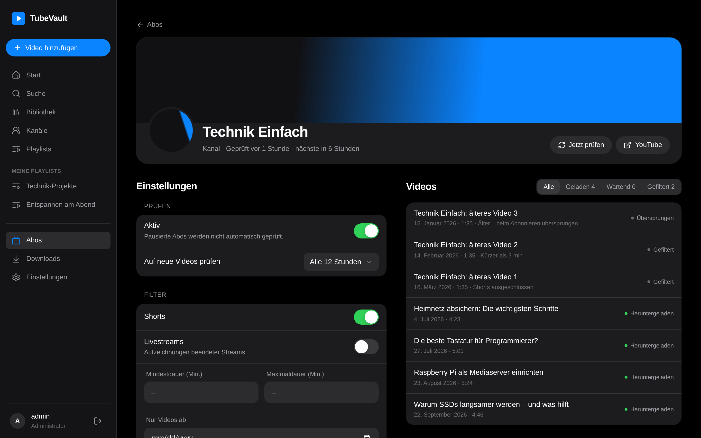

<p align="center">
  
</p>

<h1 align="center">TubeVault</h1>

<p align="center">
  Selbstgehosteter Media-Server für YouTube-Inhalte – Videos herunterladen, mit Metadaten
  ablegen und in einer ruhigen Bibliothek im Stil von Apple TV ansehen.<br />
  Ohne Werbung, ohne Tracking, komplett auf deinem Server.
</p>

<p align="center">
  <a href="https://github.com/Lua-x/TubeVault/actions/workflows/ci.yml"></a>
  <a href="https://github.com/Lua-x/TubeVault/actions/workflows/docker.yml"></a>
</p>

<p align="center">
  <picture>
    <source media="(prefers-color-scheme: light)" srcset="docs/screenshots/home-desktop-light.png" />
    
  </picture>
</p>

<p align="center">
  
  &nbsp;
  
</p>

<p align="center">
  
  &nbsp;
  
</p>

<p align="center">
  
  &nbsp;
  
</p>

> Die Screenshots zeigen Demo-Videos, die mit `backend/scripts/seed_demo.py` erzeugt wurden.

## Funktionen

**Version 0.3 – Bibliothek & Wiedergabe**

- Startseite mit „Weiterschauen“, „Neu von deinen Abos“ und deinen Kanälen
- Wiedergabefortschritt pro Benutzer: Videos setzen dort fort, wo du aufgehört hast,
  und gelten kurz vor Schluss als gesehen. Filter „Ungesehen“, „Angefangen“, „Gesehen“
- Kanalseiten mit Banner, Avatar und allen Videos – direkt von dort abonnieren
- Volltextsuche über Titel, Beschreibung und Kanal (findet „Brücke“ auch mit „brucke“)
- Eigene Playlists: anlegen, per Drag & Drop sortieren, am Stück abspielen
- [SponsorBlock](https://sponsor.ajay.app): Sponsoren, Intros & Co. beim Abspielen
  überspringen (mit „Zurück“) oder beim Download herausschneiden – global oder pro Abo
- Als App installierbar (PWA) auf iPhone, Android und Desktop

**Version 0.2 – Abos & Automatisierung**

- Kanäle und Playlists abonnieren; neue Videos werden automatisch geladen
- Prüfintervall pro Abo (15 Minuten bis wöchentlich), „Jetzt prüfen“ jederzeit
- Filter pro Abo: Shorts, Livestreams, Mindest-/Maximaldauer, nur Videos ab Datum X
- Qualität und Format pro Abo (z. B. max. 1080p, H.264, MKV)
- Aufräumen: Videos älter als X Tage löschen oder nur die neuesten N behalten –
  von Hand hinzugefügte Videos bleiben immer
- Beim Abonnieren nur die neuesten Videos laden (5, 25, 100 oder alle)
- Verlauf pro Abo: welche Videos geladen, gefiltert oder übersprungen wurden – und warum
- Download-Queue mit Pause/Fortsetzen (einzeln und komplett), Wiederholen, Abbrechen
- Kanal-Avatar und -Banner (auch als `folder.jpg`/`banner.jpg` für Jellyfin)

**Version 0.1 (MVP)**

- Video per YouTube-Link hinzufügen – Download mit [yt-dlp](https://github.com/yt-dlp/yt-dlp) und ffmpeg
- Metadaten, Thumbnail, Kapitel und Untertitel (manuell + automatisch in Originalsprache)
- Download-Queue mit Live-Fortschritt (WebSocket), Abbrechen, Wiederholen und automatischen
  Retries mit Backoff bei Netzwerkfehlern und Rate-Limits
- Bibliothek mit Suche und Sortierung, Videoseite mit Player (Spulen per HTTP Range,
  Kapitel, Untertitel, Tastaturkürzel, Bild-in-Bild)
- MP4 (Standard, H.264 für maximale Kompatibilität) oder MKV, Qualität bis 4K
- Mehrere Benutzer, Admin-Rolle, Login mit Session-Cookie
- Dunkles, Apple-artiges UI mit Hell/Dunkel/System, Sidebar auf dem Desktop,
  Tab-Bar auf dem Smartphone
- Ordnerstruktur kompatibel mit Jellyfin/Plex: `/media/<Kanal>/<Jahr>/<Titel> [<ID>].mp4`
- Ein einziger Container, läuft auf amd64 und arm64 (Raspberry Pi, NAS)

**Geplant**

| Version | Inhalt |
| ------- | ------ |
| 0.4 | HLS-Transcoding, Admin-Dashboard mit yt-dlp-Update-Button, Import vorhandener Dateien, API-Tokens, `.nfo`-Dateien |

## Installation

Voraussetzung: Docker mit Compose. Lege einen Ordner an (z. B. `~/tubevault`) und darin eine
`docker-compose.yml`.

### Variante A: fertiges Image von GHCR (empfohlen)

```yaml
services:
  tubevault:
    image: ghcr.io/lua-x/tubevault:latest
    container_name: tubevault
    ports:
      - "8096:8096"
    environment:
      - PUID=1000
      - PGID=1000
      - TZ=Europe/Berlin
    volumes:
      - ./config:/config
      - /pfad/zu/videos:/media
    restart: unless-stopped
```

```sh
docker compose up -d
```

Öffne dann `http://<server>:8096`. Beim ersten Aufruf legst du das Administrator-Konto an.

> **Privates Repository:** Solange das Repository privat ist, ist auch das Image auf GHCR
> privat. Melde dich dann auf dem Server einmalig an – mit einem
> [Personal Access Token](https://github.com/settings/tokens) mit dem Recht `read:packages`:
> `echo <TOKEN> | docker login ghcr.io -u <dein-github-name> --password-stdin`.
> Alternativ das Paket unter *GitHub → Packages → tubevault → Package settings* öffentlich machen.

### Variante B: selbst bauen

```yaml
services:
  tubevault:
    build: .
    container_name: tubevault
    ports:
      - "8096:8096"
    environment:
      - PUID=1000
      - PGID=1000
      - TZ=Europe/Berlin
    volumes:
      - ./config:/config
      - /pfad/zu/videos:/media
    restart: unless-stopped
```

```sh
git clone https://github.com/Lua-x/TubeVault.git
cd TubeVault
docker compose up -d --build
```

Die mitgelieferte [`docker-compose.yml`](docker-compose.yml) ist genau diese Variante.

### Benutzer-IDs (PUID/PGID)

Der Container startet kurz als root, übernimmt `PUID`/`PGID`, setzt die Rechte von `/config`
und läuft danach als normaler Benutzer – wie bei den linuxserver.io-Images. Die IDs deines
Benutzers bekommst du mit `id`. In `/media` werden nur der oberste Ordner und
`/media/.tubevault` angepasst, deine vorhandenen Dateien bleiben unangetastet.

Statt `PUID`/`PGID` funktioniert auch `user: "1000:1000"` in der Compose-Datei. Dann läuft
gar nichts als root – die Ordner für `/config` und `/media` musst du dann vorher selbst
anlegen und diesem Benutzer geben.

## Konfiguration

| Variable | Standard | Bedeutung |
| -------- | -------- | --------- |
| `PUID` / `PGID` | `1000` | Benutzer und Gruppe, denen die Dateien gehören |
| `TZ` | `Etc/UTC` | Zeitzone, z. B. `Europe/Berlin` |
| `PORT` | `8096` | Port im Container |
| `BASE_PATH` | leer | Unterpfad hinter einem Reverse Proxy, z. B. `/tubevault` |
| `ADMIN_USER` / `ADMIN_PASSWORD` | leer | Legt beim ersten Start einen Admin an (Passwort ≥ 8 Zeichen). Leer = Einrichtung im Browser |
| `YTDLP_AUTO_UPDATE` | `true` | yt-dlp bei jedem Start auf die neueste Version aktualisieren |
| `FORWARDED_ALLOW_IPS` | `*` | IPs der Reverse Proxys, deren `X-Forwarded-*`-Header vertraut wird |
| `LOG_LEVEL` | `INFO` | `DEBUG`, `INFO`, `WARNING`, `ERROR` |
| `SESSION_DAYS` | `30` | Wie lange eine Anmeldung gültig bleibt |

Alles Weitere – Format (MP4/MKV), maximale Qualität, H.264 bevorzugen, Untertitel-Sprachen,
SponsorBlock, parallele Downloads, Benutzer – stellst du in der App unter **Einstellungen** ein.
Jeder Benutzer legt dort außerdem fest, ob Playlists automatisch weiterlaufen und ob
SponsorBlock-Abschnitte automatisch übersprungen werden.
Eine Vorlage für eine `.env`-Datei liegt in [`.env.example`](.env.example).

### Volumes

| Pfad | Inhalt |
| ---- | ------ |
| `/config` | Datenbank (`tubevault.db`), Logs (`logs/`), aktualisiertes yt-dlp (`.runtime/`), Caches |
| `/media` | Videos, Thumbnails, Untertitel – der Unterordner `.tubevault/` enthält nur temporäre Downloads |

Ordnerstruktur in `/media`:

```
/media
└── Kanalname/
    ├── folder.jpg        (Kanal-Avatar)
    ├── banner.jpg        (Kanal-Banner)
    └── 2026/
        ├── Titel des Videos [dQw4w9WgXcQ].mp4
        ├── Titel des Videos [dQw4w9WgXcQ]-thumb.jpg
        ├── Titel des Videos [dQw4w9WgXcQ].de.vtt
        └── Titel des Videos [dQw4w9WgXcQ].en.vtt
```

Diese Struktur können Jellyfin und Plex parallel als Bibliothek einlesen. Titel, Kapitel und
Beschreibung sind zusätzlich in die Videodatei eingebettet.

### Abos

Unter **Abos → Abonnieren** fügst du einen Kanal (`https://www.youtube.com/@name`,
`/channel/…`, `/c/…`) oder eine Playlist (`…/playlist?list=…`) hinzu.

- **Vorhandene Videos:** Beim ersten Prüfen lädt TubeVault standardmäßig nur die neuesten 5
  Videos. Ältere werden als „übersprungen“ gemerkt und später nicht nachgeladen.
- **Filter** greifen zweimal: grob anhand der Kanalliste (spart Downloads) und exakt, sobald
  die Metadaten eines Videos geladen sind. Herausgefilterte Videos tauchen im Verlauf des Abos
  mit Grund auf. Nach einer Filteränderung bewertet „Neu bewerten“ sie noch einmal.
- **Aufräumen** („älter als X Tage“ nach Upload-Datum, „nur die neuesten N“) läuft stündlich
  und nach jedem Download. Gelöscht wird ein Video nur, wenn kein anderes Abo es behalten will
  und es nicht von Hand hinzugefügt wurde. Gelöschte Videos lädt das Abo nicht erneut.
- **Kanäle**: Für Shorts und Livestreams werden die jeweiligen Tabs des Kanals mitgelesen.
  Laufende oder angekündigte Livestreams werden erst nach dem Ende geladen.

### SponsorBlock

[SponsorBlock](https://sponsor.ajay.app) ist eine Community-Datenbank mit markierten
Abschnitten in YouTube-Videos. Unter **Einstellungen → SponsorBlock** (und pro Abo) wählst du:

- **Aus** (Standard): keine Verbindung zu SponsorBlock.
- **Überspringen:** Die Abschnitte erscheinen als blaue Markierungen auf der Zeitleiste und
  werden beim Abspielen übersprungen. Ein Hinweis mit „Zurück“ macht das rückgängig. Die
  Datei bleibt unverändert; neue Markierungen werden für frische Videos regelmäßig nachgeladen.
- **Herausschneiden:** Die Abschnitte werden beim Download dauerhaft aus der Datei entfernt –
  ideal, wenn du die Videos auch in Jellyfin/Plex schaust. Gilt nur für neue Downloads.

Welche Kategorien zählen (Sponsor, Eigenwerbung, Abo-Erinnerung, Intro, Abspann, …), stellst
du ebenfalls dort ein.

### Als App installieren (PWA)

TubeVault lässt sich wie eine App auf den Startbildschirm legen – ohne Browserleiste und mit
eigenem Icon:

- **iPhone/iPad:** in Safari *Teilen → Zum Home-Bildschirm*
- **Android:** in Chrome *⋮ → App installieren*
- **Desktop:** in Chrome oder Edge das Installieren-Symbol in der Adressleiste

Android und Desktop-Browser bieten das nur über **HTTPS** an (oder auf `localhost`), also
z. B. hinter einem [Reverse Proxy](#reverse-proxy) mit Zertifikat. Gecacht werden nur die
Oberfläche und ihre Dateien – deine Videos kommen immer live vom Server.

### MP4 oder MKV?

Beides geht – global in den Einstellungen oder pro Video im Dialog „Video hinzufügen“.

- **MP4 (Standard):** spielt in jedem Browser direkt ab, auch in Safari und auf iPhone/iPad.
  Mit „H.264 bevorzugen“ ist die Kompatibilität maximal (YouTube bietet H.264 bis 1080p).
- **MKV:** flexibler Container, spielt in Chrome, Edge und Firefox, aber **nicht in Safari/iOS**.
  Für solche Geräte kommt in Version 0.4 das Transcoding.

## Reverse Proxy

TubeVault funktioniert hinter Nginx, Nginx Proxy Manager, Caddy und Traefik – inklusive
WebSockets (Live-Fortschritt). Für einen Unterpfad setzt du `BASE_PATH`; ob der Proxy den
Präfix weiterreicht oder abschneidet, ist egal.

<details>
<summary>Nginx / Nginx Proxy Manager</summary>

```nginx
location / {
    proxy_pass http://tubevault:8096;
    proxy_http_version 1.1;
    proxy_set_header Host $host;
    proxy_set_header X-Forwarded-For $proxy_add_x_forwarded_for;
    proxy_set_header X-Forwarded-Proto $scheme;
    proxy_set_header Upgrade $http_upgrade;
    proxy_set_header Connection "upgrade";
    proxy_buffering off;
}
```

Im Nginx Proxy Manager reicht es, beim Proxy Host **Websockets Support** einzuschalten.
</details>

<details>
<summary>Caddy</summary>

```caddy
tube.example.com {
    reverse_proxy tubevault:8096
}
```

Mit Unterpfad (`BASE_PATH=/tubevault`):

```caddy
example.com {
    handle /tubevault* {
        reverse_proxy tubevault:8096
    }
}
```
</details>

<details>
<summary>Traefik (Labels)</summary>

```yaml
    labels:
      - traefik.enable=true
      - traefik.http.routers.tubevault.rule=Host(`tube.example.com`)
      - traefik.http.routers.tubevault.entrypoints=websecure
      - traefik.http.routers.tubevault.tls.certresolver=letsencrypt
      - traefik.http.services.tubevault.loadbalancer.server.port=8096
```
</details>

## Updates

- **yt-dlp** aktualisiert sich bei jedem Containerstart selbst (in `/config/.runtime`),
  ohne dass das Image neu gebaut werden muss. YouTube ändert häufig Details – ein Neustart
  (`docker compose restart`) bringt die neueste Version.
- **TubeVault** selbst: `docker compose pull && docker compose up -d`.
- **Automatisch** mit [Watchtower](https://github.com/containrrr/watchtower), das Container
  aktualisiert, sobald ein neues Image auf GHCR liegt:

  ```yaml
    watchtower:
      image: containrrr/watchtower
      volumes:
        - /var/run/docker.sock:/var/run/docker.sock
        # Nur bei privatem Image nötig (nach `docker login ghcr.io`):
        - ~/.docker/config.json:/config.json:ro
      command: --cleanup --interval 86400 tubevault
      restart: unless-stopped
  ```

## Hilfe

| Problem | Lösung |
| ------- | ------ |
| `/config is not writable` im Log | `PUID`/`PGID` passen nicht zu den Ordnerrechten, oder bei `user:` gehört der Ordner nicht diesem Benutzer |
| Passwort vergessen | `docker exec -it tubevault python -m app reset-password <benutzer>` |
| Downloads scheitern mit „not a bot“ / HTTP 429 | YouTube bremst. TubeVault versucht es automatisch später erneut (Backoff bis 6 h) |
| Video spielt nicht ab (MKV) | Safari/iOS können kein MKV – Format in den Einstellungen auf MP4 stellen |
| „App installieren“ fehlt | Android/Desktop verlangen HTTPS – TubeVault hinter einen Reverse Proxy mit Zertifikat stellen |
| Logs | `docker logs tubevault` oder `config/logs/tubevault.log` |

## Entwicklung

```sh
# Backend (Python 3.12, uv)
cd backend
uv sync
CONFIG_DIR=./.dev/config MEDIA_DIR=./.dev/media uv run python -m app   # http://localhost:8096
uv run pytest && uv run ruff check app tests && uv run mypy app

# Demo-Videos ohne YouTube-Zugang erzeugen (braucht ffmpeg); Fortschritt und
# Playlists bekommt der erste Admin – also vorher einmal anmelden
CONFIG_DIR=./.dev/config MEDIA_DIR=./.dev/media uv run python scripts/seed_demo.py

# Frontend (Node 24) – Vite-Dev-Server mit Proxy auf das Backend
cd frontend
npm ci
npm run dev        # http://localhost:5173
npm run lint && npm run typecheck && npm test
```

Aufbau:

```
backend/app/
  routers/    HTTP- und WebSocket-Endpunkte
  services/   yt-dlp, Bibliothek/Dateinamen, Abos, Suche, SponsorBlock, Auth
  workers/    Download-Queue, Abo-Scheduler
  models/     SQLAlchemy-Modelle, migrations/ (Alembic)
frontend/src/
  pages/ components/ hooks/ api/ lib/
docker/       Entrypoint
```

Commits folgen [Conventional Commits](https://www.conventionalcommits.org/de/). Pro Version
gibt es einen Git-Tag (`v0.1.0`, …); GitHub Actions baut daraus das Image für amd64 und arm64
und veröffentlicht ein Release.

## Datenschutz

TubeVault sendet keine Telemetrie und lädt keine externen Skripte oder Schriften. Verbindungen
nach außen gehen nur zu YouTube (Downloads), zu PyPI (yt-dlp-Update beim Start, abschaltbar)
und – nur wenn du es einschaltest – zu SponsorBlock. Dabei verlassen nur die ersten vier
Zeichen eines SHA-256-Hashes der Video-ID den Server; SponsorBlock erfährt also nicht, welches
Video du schaust.
