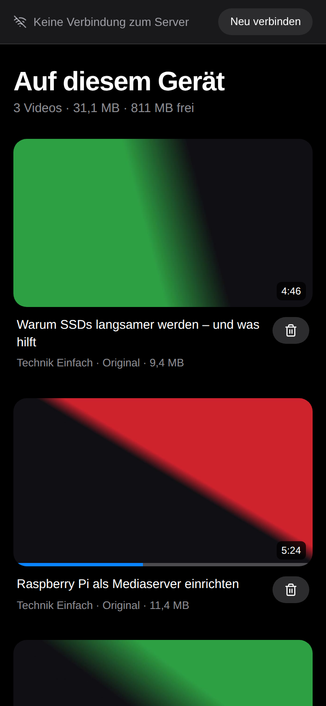
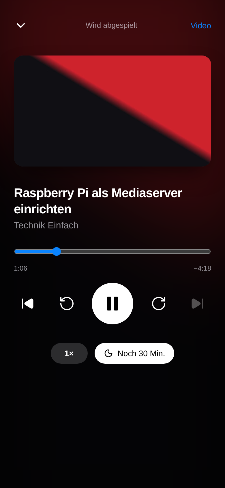

# Watching

- [Playback on every device](#playback-on-every-device)
- [Hardware acceleration](#hardware-acceleration)
- [Seek previews and even volume](#seek-previews-and-even-volume)
- [Speed per channel](#speed-per-channel)
- [Subtitles from speech recognition](#subtitles-from-speech-recognition)
- [Save to device](#save-to-device)
- [Listening and podcasts](#listening-and-podcasts)
- [Installing the app (PWA)](#installing-the-app-pwa)
- [Without internet](#without-internet)

## Playback on every device

The player checks what your browser can do and picks by itself:

1. **Direct:** the original file plays – the normal case.
2. **Remuxed:** if only the container doesn't fit (e.g. MKV on an iPhone), ffmpeg copies video
   and audio into an MP4 once. That takes a few seconds and hardly any CPU.
3. **Transcoded:** if the device can't decode the codec (e.g. AV1 on older devices) or you pick
   a lower quality in the player (⚙︎ at the top right), TubeVault converts the video to H.264
   while you watch (HLS). Seeking works; ffmpeg only runs while someone is watching.

Remuxed and transcoded copies are kept in `media/.tubevault/cache` and cleaned up
automatically (size adjustable under **Einstellungen → Umwandlung**, settings → transcoding).
The originals are never changed.

The player also has chapters, subtitles, keyboard shortcuts, picture-in-picture and – for
playlists – "up next" with autoplay after 5 seconds (a per-user setting under
**Einstellungen → Wiedergabe**). Videos resume where you stopped and count as watched shortly
before the end.

The **moon** at the top right of the player is a **sleep timer**: after 5 to 60 minutes, or at
the end of the video, the sound fades out and the video pauses – also in full screen and in the
middle of a playlist (a running timer carries on into the next video). While it runs, the moon
shows the time left.

Below the player, the actions you use most are at hand – watched, watch later, playlist,
folder. Everything else is in **⋯**: listen, watch together, save to device, download the file,
open on YouTube and, for admins, create subtitles, reload and delete.

## Hardware acceleration

Transcoding works in software, but a GPU makes it much faster and more economical. Pass the GPU
through in `docker-compose.yml`, then choose it under **Einstellungen → Umwandlung** and test it
with **Prüfen** (check):

```yaml
    # Intel (Quick Sync) or AMD – VAAPI
    devices:
      - /dev/dri:/dev/dri

    # NVIDIA – needs the NVIDIA Container Toolkit on the host
    deploy:
      resources:
        reservations:
          devices:
            - driver: nvidia
              count: all
              capabilities: [gpu, video]
```

TubeVault adds its internal user to the group that owns `/dev/dri` automatically. If you start
the container with `user:`, add `group_add:` with the group ID of `/dev/dri/renderD128`
instead (`stat -c %g /dev/dri/renderD128`). If something doesn't work with the GPU, TubeVault
falls back to software by itself – the log says why.

## Seek previews and even volume

Under **Einstellungen → Medienanalyse** (settings → media analysis, on by default) TubeVault
looks at every video once in the background, at the lowest priority:

- **Vorschaubilder beim Spulen** (seek previews): small pictures above the timeline, about
  1–2 MB per hour of video in `/media/.tubevault/trickplay`.
- **Lautheit messen** (measure loudness, EBU R128): with **Einstellungen → Wiedergabe →
  Lautstärke angleichen** (even out volume), loud videos get quieter and quiet ones a little
  louder (at most +6 dB, with a limiter against clipping). Not on iPhone and iPad, because of
  Safari.

A new video is analysed right after its download, the existing library bit by bit. When a file
is replaced (better quality), it is measured again.

## Speed per channel

The player remembers the playback speed for every channel – 1.5× for the podcast channel,
normal for music. The audio player uses the same speeds.

## Subtitles from speech recognition

For your own videos and anything else without subtitles, TubeVault can make subtitles from the
audio track – with [faster-whisper](https://github.com/SYSTRAN/faster-whisper), entirely on
your server. Neither the program nor a model is part of the image, so it stays small and
nothing is downloaded without being asked for:

1. Under **Einstellungen → Untertitel per Spracherkennung** (settings → subtitles from speech
   recognition) choose a model and click **Einrichten** (set up). TubeVault then installs
   faster-whisper from PyPI once (about 450 MB in `/config/.runtime/speech`) and downloads the
   model from Hugging Face to `/config/models`:

   | Model | Size | |
   | ----- | ---- | - |
   | `tiny` | 75 MB | fastest, for a Raspberry Pi |
   | `base` | 145 MB | usually the best choice |
   | `small` | 485 MB | more accurate, about three times slower, needs about 1 GB of RAM |

2. Choose **Untertitel erzeugen** (create subtitles) in the **⋯** menu of a video – or
   **Eigene Videos ohne Untertitel** (own videos without subtitles) for all at once, or switch on
   **Neue eigene Videos automatisch** (new own videos automatically).

Recognition runs as a separate process at the lowest priority on half of the CPU cores and
doesn't go online. The subtitles are saved as `Title [ID].de.speech.vtt` next to the video
(Jellyfin and others read the "de" from it), are called "Deutsch (Spracherkennung)" in the
player and even appear in a video that is already playing. Creating them again replaces the
old ones. **Entfernen** (remove) deletes the program and the models again; subtitles already
created stay.

Without internet on the server: download the model on another computer from
`huggingface.co/Systran/faster-whisper-base` (`model.bin`, `config.json`, `tokenizer.json`,
`vocabulary.txt`) and put it into `/config/models/faster-whisper-base/`. Installing the program
itself needs access to PyPI.

## Save to device



For when your server can't be reached (train, plane, holiday): **Aufs Gerät laden** (save to
device) in a video's **⋯** menu, or **Aufs Gerät** for a playlist, stores videos in the installed
app.

- **Original:** the file as it is on the server – MKV is remuxed to MP4 for it once. If the
  codec doesn't suit the device, TubeVault only offers the compact versions.
- **Kompakt · 720p** and **Sparsam · 480p:** your server converts the video to H.264 once,
  which plays on every device. At most about 1.4 GB per hour in 720p and 0.65 GB in 480p,
  usually much less – the dialog estimates the size beforehand.
- **Nur Ton** (audio only): about 1 MB per minute, for the [audio player](#listening-and-podcasts).

Everything saved is listed under **Auf diesem Gerät** (on this device, also a tab in the
library), with subtitles, chapters and thumbnail. If the server can't be reached when the app
opens, it starts right there. The device remembers where you stopped and passes it on once the
server answers again.

Good to know:

- It needs **HTTPS** (see [reverse proxy](reverse-proxy.md)) – over `http://` with an IP address
  browsers don't grant storage, and the button doesn't appear.
- **The app has to stay open** until the download is finished. Browsers can't continue
  downloads in the background; an interrupted download starts over on the next attempt.
- Videos are stored in the browser's storage for this site. Clearing the site data or removing
  the app from the home screen deletes them too. TubeVault asks the browser to keep the storage
  permanently; when space runs low, the system may clean up anyway.
- **iPhone/iPad:** add TubeVault to the home screen first and open it from there. Safari gives
  websites less space than an installed app, and iOS may delete stored data when space is low.
  For long videos choose the compact version and don't lock the iPhone while saving.
- Every device and every user has their own selection. After signing out, the app shows nothing
  without the server.

<br clear="right" />

## Listening and podcasts



Much of YouTube is really for listening: talks, lectures, audiobooks, music. **Anhören**
(listen) in a video's **⋯** menu (or for a playlist) plays only the sound:

- A mini player stays at the bottom while you browse the library. Tapping it opens the full
  player with timeline, ±15 seconds, previous/next video, speed (0.75× to 2×) and a **sleep
  timer** (after 5 to 60 minutes or at the end of the video).
- The lock screen and headphone buttons control playback. Progress is saved like for videos,
  and starting a video pauses the sound.
- The server only sends the audio track (M4A). If it is AAC already – the case with the default
  MP4 – it is copied out in seconds, otherwise converted. That saves data on the go.

Whether the sound continues with the screen locked is up to the browser. iOS sometimes pauses
web apps in the background; started from the home screen it usually works better. Most
reliable is a podcast app – that's what the feeds are for.

**Als Podcast** (as a podcast) on a channel or playlist page (watch later included) gives you a
feed address for your podcast app: new videos appear there as episodes, audio only.

- The address contains a personal key, because podcast apps can't sign in. It only opens the
  feeds, their audio and their images – with your rights, so a kids profile only gets its
  channels. Under **Einstellungen → Podcasts** it can be renewed or turned off. Don't share the
  address.
- The app has to reach your server. Apps that fetch feeds on the device (e.g. AntennaPod) work
  at home or over VPN. Apps that fetch feeds through their own servers (e.g. Pocket Casts,
  Overcast) only reach a server that is reachable from the internet.
- Behind a reverse proxy, set `PUBLIC_URL` so the links in the feed are right. The feeds are
  marked as private for directories.

<br clear="right" />

## Installing the app (PWA)

TubeVault can be put on the home screen like an app – without the browser bar and with its own
icon:

- **iPhone/iPad:** in Safari *Share → Add to Home Screen*
- **Android:** in Chrome *⋮ → Install app*
- **Desktop:** in Chrome or Edge, the install icon in the address bar

Android and desktop browsers only offer this over **HTTPS** (or on `localhost`), e.g. behind a
[reverse proxy](reverse-proxy.md) with a certificate. The interface and the player are cached,
so the app starts without the server too. Videos come live from the server – except those saved
with [save to device](#save-to-device).

## Without internet

TubeVault is built for watching offline: library, search, playback, playlists and progress only
need your server, and the interface loads nothing from outside. When the internet goes down,

- downloads wait instead of failing for good after a few attempts, and start by themselves once
  the network is back (the downloads page shows it),
- subscription checks, channel art, SponsorBlock and the RSS check are postponed quietly –
  without error messages on every subscription,
- the container starts right away instead of waiting for the yt-dlp update.

TubeVault only checks whether YouTube is reachable after a network error, never on a timer.
